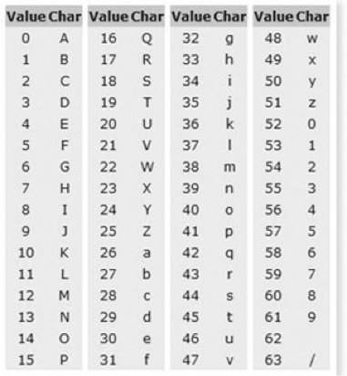

# Base64 인코딩
## 인코딩이란?
인코딩(encoding)은 정보의 형태나 형식을 표준화, 보안, 처리 속도 향상, 저장 공간 절약 등을 위해서 다른 형태나 형식으로 변환하는 처리 혹은 그 처리 방식을 말한다.

## Base64
Base64란 Binary Data를 Text로 바꾸는 Encoding의 하나로써 Binary Data를 Character set에 영향을 받지 않는 공통 ASCII 영역의 문자로만 이루어진 문자열로 바꾸는 Encoding이다.
Base64를 글자 그대로 직역하면 64진법이라는 뜻이다. 
64진법은 컴퓨터한테 특별한데 그 이유는 64가 2의 제곱수이며 2의 제곱수에 기반한 진법 중 화면에 표시되는 ASCII 문자들로 표시할 수 있는 가장 큰 진법이기 때문이다.

## 인코딩 과정

