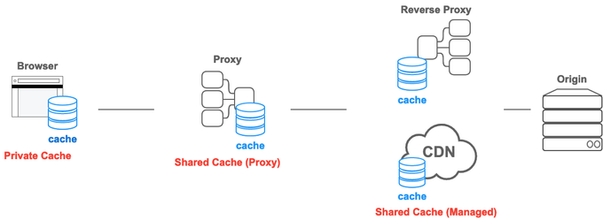

# HTTP 캐시에 대해

# 캐시

캐시(Cache)란 컴퓨터 시스템에서 데이터나 값을 미리 복사해 놓는 임시 저장소

이를 통해 이후에 동일한 데이터나 값을 요청할 때 더 빠르게 처리할 수 다.그리고 데이터를 캐시에 저장하는 행위를 캐싱이라고 한다. 일반적으로 캐싱은 캐시에 저장된 데이터에 접근하는 시간에 비해 **원본 데이터에 접근하는 시간이 오래 걸리는 경우** 사용한다.

# HTTP 캐시

HTTP 캐시는 이전에 받은 HTTP 응답을 저장하는 장소 이는 같은 리소스에 대한 이후의 요청에 대해 서버로부터 리소스를 다시 다운로드하지 않고 캐시에서 가져와 응답 시간을 크게 단축시키는 데 도움이 된다.

# HTTP 캐시 종류

*출처: https://developer.mozilla.org/en-US/docs/Web/HTTP/Caching*

### **Private Cache**

웹 브라우저에 저장되는 캐시이며, 다른 사람이 접근할 수 없다. 단, 서버 응답에 **`Authorization`** 헤더가 포함되어 있다면 Private Cache에 저장되지 않는다.

### **Shared Cache**

Shared Cache 는 웹 브라우저와 서버 사이에서 동작하는 캐시를 의미하며, 다시 Proxy Cache와 Managed Cache 2가지로 나뉜다.

### **Proxy Cache**

(포워드) 프록시에서 동작하는 캐시이다.

### **Managed Cache**

AWS Cloudfront 혹은 Cloudflare 와 같은 CDN 서비스 그리고 리버스 프록시에서 동작하는 캐시이다. 이런 서비스들의 관리자 패널에서 직접 캐시에 대한 설정을 관리하거나 리버스 프록시 설정으로 관리할 수 있으므로 Managed Cache라고 불린다.

# Cache-control

- **`no-cache`**: 캐시된 리소스를 사용하기 전에 항상 원 서버에 새로운 버전을 요청한다.
- **`no-store`**: 리소스를 캐시하지 않는다.
- **`public`**: 리소스를 어떤 사용자든 캐시할 수 있다.
- **`private`**: 리소스를 특정 사용자만 캐시할 수 있다.
- **`max-age=<seconds>`**: 캐시된 리소스가 유효한 시간을 지정합니다. 예를 들면 **`max-age=3600`**은 리소스가 캐시된 이후 1시간 동안 유효하다는 것을 의미한다.
