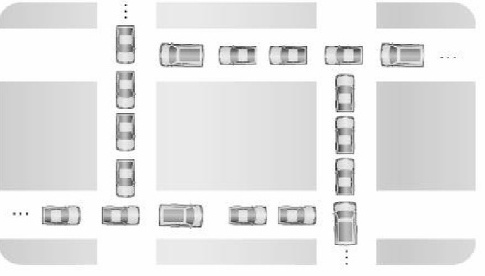

# 교착상태(데드락)

## 교착상태

교착상태(Dead Lock)은 상호 배제에 의해 나타나는 문제점으로, 둘 이상의 프로세스들이 자원을 점유한 상태에서 서로 다른 프로세스가 점유하고 있는 자원을 요구하며 무한정 기다리는 현상을 의미합니다.

위 그림과 같이 자동차`(프로세스)`들이 현재 위치한 길`(자원)`을 점유함과 동시에 다른 차가 사용하는 길을 사용하려고 대기하고 있지만 다른 길을 사용할 수 없으며 현재 길에서도 벗어나지 못하는 상태입니다.

## 교착상태 발생의 필요 충분 조건

교착상태가 발생하기 위해서는 다음의 네가지 조건이 충족되어야 하는데, 이 네가지 조건중 하나라도 충족되지 않으면 교착상태가 발생하지 않습니다.

|  상호배제(Mutual Exclusion) | 한번에 한개의 프로세스만이 공유 자원을 사용할 수 있어야 합니다. |
| --- | --- |
| 점유와 대기(Hold and Wait)  | 최소한 하나의 자원을 점유하고 있으면서 다른 프로세스에 할당되어 사용되고 있는 자원을 추가로 점유하기 이해 대기하는 프로세스가 있어야 합니다.  |
|  비선점(Non-preemption) | 다른 프로세스에 할당된 자원은 사용이 끝날 때까지 강제로 빼앗을 수 없어야합니다.  |
|  환형 대기(Circular Wait)  | 공유자원과 공유자원을 사용하기 위해 대기하는 프로세스들이 원형으로 구성되어 있어 자신에게 할당된 자원을 점유하면서 앞이나 뒤에 있는 프로세스의 자원을 요구해야 합니다.  |

## 예방기법

교착상태 예방 기법은 교착상태가 발생하지 않도록 사전에 시스템을 제어하는 방법으로 교착상태 발생의 네가지 조건 중에서 어느 하나를 제거함으로써 수행됩니다. 자원 낭비가 가장 심한 기법입니다.

**상호 배제(Mutual Exclusion)부정 :** 한번에 여러개의 프로세스가 공유 자원을 사용할 수 있도록 합니다.

**점유 및 대기(Hold and Wait) 부정 :** 프로세스가 실행되기 전 필요한 모든 자원을 할당하여 프로세스 대기를 없애거나 자원이 점유되지 않은 상태에서만 자원을 요구하도록 합니다.

**비선점(Non-preemption)부정 :** 자원을 점유하고 있는 프로세스가 다른 자원을 요구할 때 점유하고 있는 자원을 반납하고, 요구한 자원을 사용하기 위해 기다리게 합니다.

**환형 대기(Circular Wait)부정 :** 자원을 선형 순서로 분류하여 고유 번호를 할당하고, 각 프로세스는 현재 점유한 자원의 고유 번호보다 앞이나 뒤 어느 한쪽 방향으로만 자원을 요구하도록 하는것입니다.
