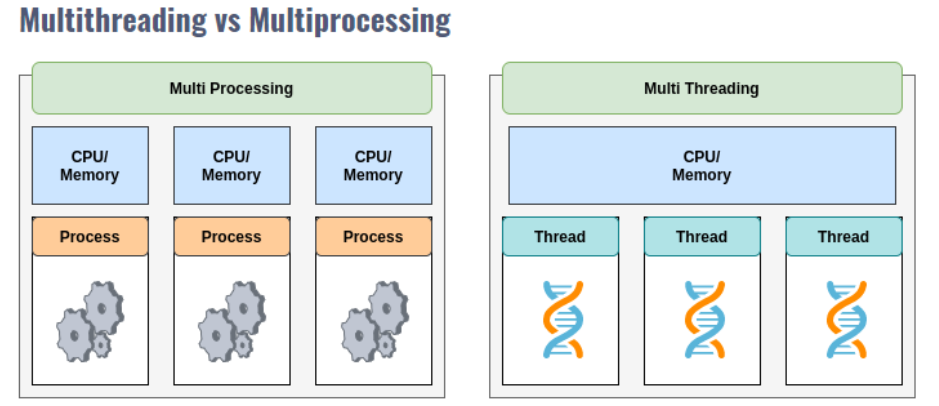
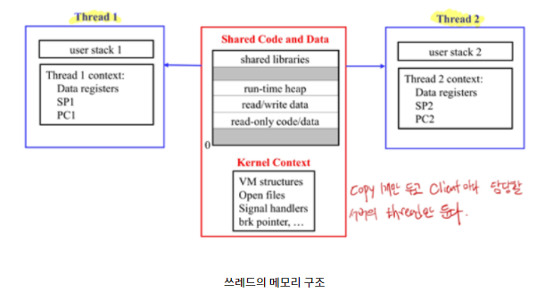

## 멀티 프로세싱

컴퓨터 시스템에서 1개 이상의 프로세스가 동시적으로 실행가능하다는 것을 의미한다.

여러 개의 프로세스 유닛(CPU)을 가진 하드웨어에서 활용가능하다. 다수의 프로세서로 다스의 프로세스를 협력적으로 동시에 처리하는 것이다.

fork()를 통해 자식 프로세스를 생성하는데, 생성된 프로세스는 자신만의 메모리 영역(Heap, Stack, Code, Data)을 소유한다.

프로세스끼리 독립되기에 프로세스 사이에서 공유할 자원이 있다면 프로세스간 통신 메커니즘(Inter Process Communication: IPC)을 활용해야 한다.

### 특징

- 멀티 프로세싱을 사용하면 프로세스를 독립적으로 운영할 수 있어 시스템의 안정성을 높일 수 있다.
- 병렬적으로 처리 가능한 작업으로 분해하여 성능을 향상시킬 수 있다.

## 멀티 스레딩

하나의 프로세스 안에 여러 개의 실행 흐름(스레드)를 두는 방식으로 여러 실행을 동시에 실행하도록 하나의 프로세스를 운영하는 방식이다.

- 소프트웨어적인 기법으로 프로세스를 작은 단위의 스레드로 분할하여 운영하기에 반드시 다중 CPU가 지원될 필요는 없다.
- 프로세스 내에서 데이터, 힙, 코드 영역을 공유하기 때문에 자원의 관점과 문맥교환(Context Switching)관점에서 멀티프로세싱 방법보다 효율적이다.

### **멀티 프로세싱 vs 멀티 스레딩의 예시 [ 쉽게 배우는 운영체제 참고 ]**

인터넷 익스플로러는 멀티 스레딩 기법으로 브라우저를 실행시켰다. 자원의 효율성을 높여주는 장점이 있지만 단점은

스레드에서 생긴 문제가 프로세스 전체에 영향을 미친다는 점이다.

[ 과거 IE를 사용한 분들은 이를 경험해 봤을 것이다. 하나의 탭이 멈추는데 해당 브라우저 전체를 꺼야 했다. ]

반면 크롬의 경우 멀티 프로세싱 방식으로 브라우저를 운영한다.

즉 하나의 탭은 하나의 프로세스인 셈이다. 그래서 탭 하나에 문제가 생겨도 다른 탭에는 영향을 주지 않는다.

멀티코어 CPU가 대중화되면서 여러 개의 프로세스를 여러 개의 CPU에서 동시에 실행할 수 있는 환경이 되면서

멀티 프로세싱을 활용해도 크게 문제가 되지 않는 것이다. [ 대신 자원을 어마 무시하게 잡아먹는다. ]
