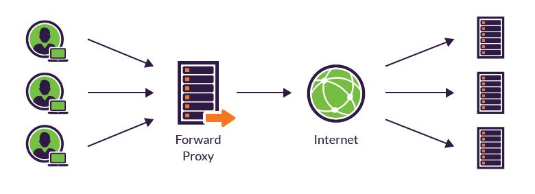
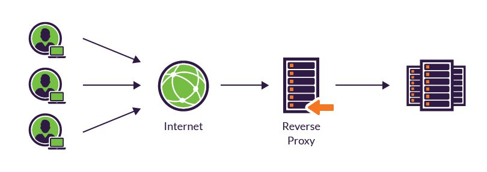

# 프록시란?

# 프록시 (Proxy)

프록시(Proxy)란 클라이언트와 서버 사이에서 중계기로서 역할을 하는 컴퓨터나 소프트웨어를 말합니다.

# 프록시 종류

## 포워드 프록시

포워드 프록시는 프록시 서버가 클라이언트 앞에 놓여져 있는 경우를 말합니다. 클라이언트가 프록시 서버에게 요청한 후 프록시서버가 인터넷을 통해 결과를 다시 클라이언트에게 전달해 줍니다.

## 장점

- 캐시저장 : 프록시 서버에 캐시를 저장할 수 있습니다. 동일한 페이지를 요청할 경우에 프록시 서버에 캐시되어있는 페이지 정보를 대신 응답해줄 수 있기 때문에 요청-응답속도가 빨라진다.

## 리버스 프록시

리버스 프록시는 프록시 서버가 WEB서버/WAS서버 앞에 놓여져 있는 경우를 말합니다. 클라이언트가 인터넷을 통해 프록시서버로 요청하면 프록시서버가 클라이언트의 요청을 받아 서버로 요청을 전달합니다.

## 장점

- 서버 IP를 숨김 : 클라이언트가 내부서버로 직접적으로 요청하는게 아니라 프록시서버로 요청을 하기 때문에 내부서버의 IP정보를 숨길 수 있다. 내부서버에 직접적으로 접근하면 내부서버가 해킹을 당했을 시 DB서버도 해킹의 위험이 있을 수 있기 때문에 내부서버의 IP정보를 숨기는 것은 보안적인 측면에서 장점이다.
- 로드 밸런싱 : 대량의 트래픽을 하나의 서버로 감당해 내기엔 버겁다. 리버스 프록시 서버가 로드밸런싱을 통해 클라이언트의 요청을 여러개의 내부 서버에 적절하게 요청을 조절해 줄 수 있다.
- 캐싱 : 포워드 프록시에서도 공통적인 장점인데 프록시 서버에 같은 페이지의 요청이 들어온다면 프록시 서버에 캐시해둔 페이지 정보를 바로 응답해줄 수 있기 때문에 요청-응답 속도에 더 빠른 장점이 있다.