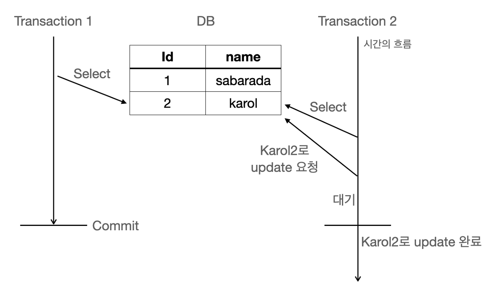
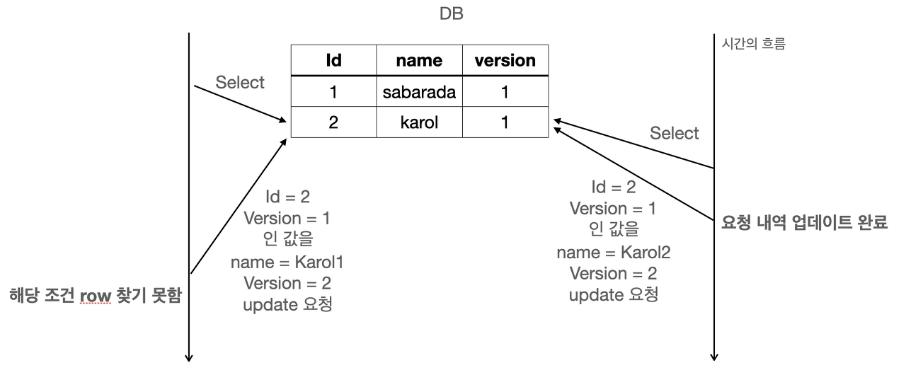

# 비관적락, 낙관적락 

# 비관적 락(Pessimistic Lock)

- 자원 요청에 따른 동시성 문제가 발생할 것이라고 예상하고 실제로 데이터에 Lock을 걸어서 정합성을 맞추는 방법입니다.
- 하나의 트랜잭션이 자원에 접근시 락을 걸고, 다른 트랜잭션이 접근하지 못하게 합니다.
- 데이터베이스에서 Shared Lock(공유잠금 또는 읽기잠금) 이나 Exclusive Lock(베타 잠금, 쓰기 잠금)을 겁니다.
    - Shared Lock : 다른 트랜잭션에서 읽기만 가능 또한 Exclusive Lock 적용 불가능
    - Exclusive Lock : 다른 트랜잭션에서 읽기, 쓰기 둘 다 불가능 또한 Shared, Exclusive Lock 추가로 적용 불가능 (쓰는 동안 읽거나, 다른 쓰기가 오는 것을 막기 위해)

## 동작방식

1. Transaction1에서 (id=2)를 조회 (name=karol)
2. Transaction2에서 (id=2)를 조회 (name=karol)
3. Transaction2에서 (name=Karol2)로 UPDATE요청
    - 하지만 Transaction1에서 이미 shared Lock을 잡고 있기 때문에 UPDATE가 불가능하고 대기
4. Transaction1에서 commit후 트랜잭션 해제
5. 대기중이였던 Transaction2에서 UPDATE 정상적으로 처리

## 장점

- 충돌이 자주 발생하는 환경에 따라서 롤백의 횟수를 줄일 수 있으므로 성능에서 유리합니다.
- `REPETABLE READ` 또는 `SERIALIZABLE` 격리성 수준을 제공하므로 데이터 무결성을 보장하는 수준이 매우 높습니다.

## 단점

- 데이터 자체에 락을 걸어버리므로 동시성이 떨어져 성능 손해를 많이 보게 됩니다. 특히 읽기가 많이 이루어지는 데이터베이스의 경우에는 손해가 더 두드러집니다.
- 서로 자원이 필요한 경우에는, 락이 걸려있으므로 데드락이 일어날 가능성이 있습니다.

# 낙관적 락(Optimistic Lock)

- 데이터를 읽거나 수정하는 시점에는 다른 사용자가 해당 데이터를 변경하지 않을 것이라는 가정을 하고 일단은 락을 걸지 않는 방법입니다.
- 데이터를 수정하는 시점에 변경 전에 다시 한 번 해당 데이터가 다른 사용자에 의해 변경되지 않았는지 확인한 후 변경을 적용하는 방식입니다.
- 만약 다른 사용자가 데이터를 변경한 경우에는 충돌이 발생하게 되고, 이 경우에는 충돌을 해결하기 위해 다시 데이터를 읽고, 변경사항을 적용해야 합니다.
- 일반적으로 **version** 의 상태를 보고 충돌을 확인하며, 충돌이 확인된경우 롤백을 진행시킵니다. (hashcode나 timestamp를 이용해서 충돌을 확인할 수 도 있습니다.)
- DB단에서 동시성을 처리하는것이 아닌, **어플리케이션단에서 처리** 합니다.

## 동작방식

1. Transaction1이 (Id=2)인 (name=karol), (version=1)을 읽음
2. Transaction2가 (id=2)인 (name=karol), (version=1)을 읽음
3. Transaction2가 (name=Karol2), (version=2)로 UPDATE 요청
4. Transaction2은 Commit 처리
5. Transaction1이 (id=2), (version=1)인 값을 (name=Karol1), (version=2)로 요청
6. 테이블에는 (Id=2), (version=1)인 값이 없으므로 UPDATE 실패
7. Application에서 다시 조회해 UDPATE를 수행해야 함

## 장점

- 충돌이 안난다는 가정하에, **동시 요청**에 대해서 처리 성능이 좋습니다.

## 단점

- 잦은 충돌이 일어나는경우 **롤백처리**에 대한 비용이 많이 들어 오히려 성능에서 손해를 볼 수 있습니다.
- 롤백 처리를 **구현**하는게 복잡할 수 있습니다.

## 참고

[낙관적(Optimistic) 락과 비관적(Pessimisitc)락](https://unluckyjung.github.io/db/2022/03/07/Optimistic-vs-Pessimistic-Lock/)

[데이터베이스 - Exclusive lock과 Shared lock의 차이](https://jeong-pro.tistory.com/94)

[[database] 낙관적 락(Optimistic Lock)과 비관적 락(Pessimistic Lock)](https://sabarada.tistory.com/175)
