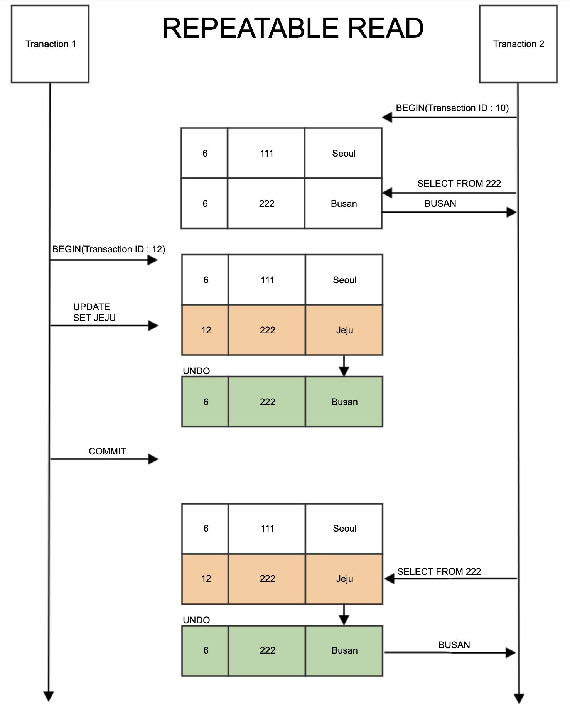
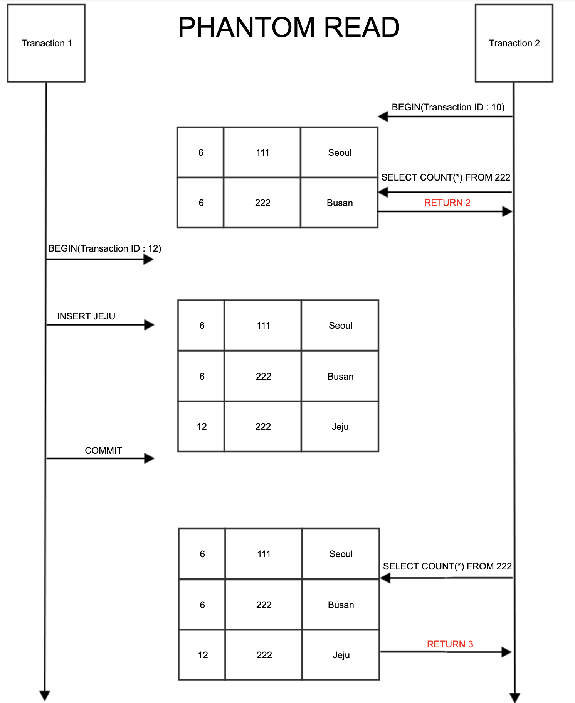

# 트랜잭션 격리수준 (isolation level)

트랜잭션 격리수준(isolation level)이란 동시에 여러 트랜잭션이 처리될 때, 트랜잭션끼리 얼마나 서로 고립되어 있는지를 나타내는 것입니다.

즉, 간단하게 말해 특정 트랜잭션이 다른 트랜잭션에 변경한 데이터를 볼 수 있도록 허용할지 말지를 결정하는 것입니다.

## READ UNCOMMITED

READ UNCOMMITED 격리수준에서는 어떤 트랜잭션의 변경 내용이 COMMIT이나 ROLLBACK과 상관없이 다른 트랜잭션에서 보여집니다.

## 문제점

이 격리 수준에서는 아래와 같은 문제가 발생할 수 있습니다.

1. A 트랜잭션에서 10번 사원의 나이를 27살에서 28살로 바꿈
2. 아직 커밋하지 않음
3. B 트랜잭션에서 10번 사원의 나이를 조회 함
4. 28살이 조회 됨
    - 이를 더티 리드(Dirty Read) 라고 한다.
5. A 트랜잭션에서 문제가 발생해 ROLLBACK 함
6. B 트랜잭션은 10번 사원이 여전히 28살이라고 생각하고 로직을 수행 함

정합성에 문제가 많은 격리 수준이기 때문에 사용하지 않는 것을 권장합니다.

## READ COMMITED

어떤 트랜잭션의 변경 내용이 COMMIT 되어야만 다른 트랜잭션에서 조회할 수 있는 격리수준입니다.

오라클 DBMS에서 기본으로 사용하고 있고, 온라인 서비스에서 가장 많이 선택되는 격리 수준입니다.

## 문제점

`NON-REPETABLE READ` 부정합 문제가 발생합니다.

1. A 트랜잭션 시작
2. B 트랜잭션 시작
3. A 트랜잭션에서 10번 사원의 나이를 27살에서 28살로 UPDATE
4. B 트랜잭션에서 10번 사원의 나이를 조회
5. 27살로 조회 됨
    - 이 데이터는 Undo 영역에 백업되어 있는 데이터를 조회 함
6. A 트랜잭션 COMMIT
7. B 트랜잭션에서 10번 사원의 나이를 조회
8. 28살로 조회 됨

A 트랜잭션이 Commit한 이후 아직 끝나지 않은 B 트랜잭션이 다시 테이블 값을 읽으면 값이 변경됨을 알 수 있습니다.

하나의 트랜잭션내에서 똑같은 SELECT 쿼리를 실행했을때는 항상 같은 결과를 가져와야 하는 `REPETABLE READ`의 정합성에 어긋납니다. 이러한 문제는 주로 입금, 출금 처리가 진행되는 금전적인 처리에서 주로 발생합니다.

예를 들어, 다른 트랜잭션에서 입금과 출금을 하는 로직이 있고 다른 트랜잭션에서 오늘 입금된 금액의 총합을 조회한다고 가정해보겠습니다. `REPETABLE READ`정합성이 보장되지 않기 때문에 총합을 계산하는 SELECT 쿼리를 여러번 날릴 때 마다 총합의 금액이 달라질 것입니다.

## REPETABLE READ

`REPETABLE READ`는 MySQL의 InnoDB 스토리지 엔진에서 기본적으로 사용되는 격리수준입니다.

- Mysql에서는 트랜잭션마다 트랜잭션 ID를 부여하여 트랜잭션 ID보다 작은 트랜잭션 번호에서 변경한 것만 읽습니다.
- Undo 공간에 백업해두고 실제 레코드 값을 변경합니다. 이러한 변경방식을 MVCC(Mutli Version Concurrency Control)이라고 합니다.
- REPETABLE READ는 이 MVCC를 위해 Undo 영역에 백업된 이전 데이터를 통해 동일한 트랜잭션 내에서는 동일한 결과를 보여줄 수 있도록 보장합니다.

위 그림에서는 Undo 영역에 백업된 데이터가 하나만 있는것으로 표현했지만, 실제로는 하나의 레코드에 대해 백업이 하나 이상 얼마든지 존재할 수 있습니다.

만약 한 사용자가 BEGIN 명령으로 트랜잭션을 시작한 후 장시간동안 트랜잭션을 종료하지 않으면 언두 영역이 백업된 데이터로 무한정 커질 수 있고, 이렇게 Undo 영역에 백업된 레코드가 많아질수록 MySQL 서버의 처리 성능이 떨어질 수 있습니다.

> REPETABLE READ 격리수준에서는 트랜잭션이 시작된 시점의 데이터를 일관되게 보여주는 것을 보장해야 하기 때문에 한 트랜잭션의 실행시간이 길어질수록 해당 시간만큼 계속 멀티 버전을 관리해야 합니다.
>
>
> 하지만 실제로 영향을 미칠 정도로 오래 지속되는 경우는 없어서… READ COMMITTED와 REPETABLE READ의 성능차이는 거의 없다고 합니다.
>

## 문제점

## PHANTOM READ

2-Transaction이 ID를 12로 갖고있고 1-Transaction이 ID를 10을 갖고있습니다. 2-Transaction에서 SELECT 쿼리를 날렸을 때 2개의 row를 조회하지만 1-Transaction에서 Commit 후 2-Transaction에서 다시 SELECT 쿼리를 날리면 3개의 row가 조회되는 현상입니다.

다른 트랜잭션에서 수행한 변경 작업에 의해 레코드가 보였다가 안보였다가 하는 현상을 PHANTOM READ라고 합니다.

SELECT .. FOR UPDATE 쿼리는 SELECT하는 레코드에 쓰기 잠금을 걸어야 하는데, 언두 레코드에는 잠금을 걸 수 없습니다.

따라서 위와 같은 쿼리는 언두 영역의 변경 전 데이터를 가져오는 것이 아니라 현재 레코드의 값을 가져오게 됩니다.

## SERIALIZABLE

가장 단순한 격리 수준이면서 가장 엄격한 격리 수준입니다. 또한 동시 처리 성능도 다른 트랜잭션 격리 수준보다 현저히 떨어집니다.

트랜잭션의 격리 수준이 SERIALIZABLE로 설정되면 읽기 작업도 공유 잠금(읽기 잠금)을 획득해야 하며, 동시에 다른 트랜잭션은 그러한 레코드를 변경할 수 없습니다.

즉, **한 트랜잭션에서 읽고 쓰는 레코드를 다른 트랜잭션에서는 절대 접근할 수 없습니다.**

### 참고

[트랜잭션의 격리 수준(isolation Level)이란?](https://nesoy.github.io/articles/2019-05/Database-Transaction-isolation)

[[db] 트랜잭션 격리 수준(isolation level)](https://joont92.github.io/db/트랜잭션-격리-수준-isolation-level/)