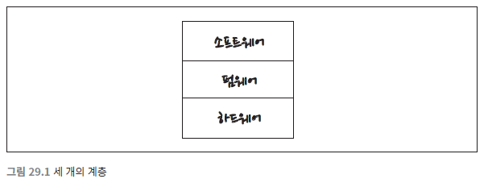

# 클린 임베디드 아키텍처

- 소프트웨어는 닳지 않지만, 펌웨어와 하드웨어는 낡아 가므로 결국 소프트웨어도 수정 해야 한다.
- 소프트웨어는 긴 시간 유용하게 쓸 수 있는 것인 반면, 펌웨어는 하드웨어가 발전
  할수록 낡아 갈 것이다.

### 펌웨어와 소프트웨어의 의존성
- 소프트웨어의 코드가 하드웨어/기술에 의존적이게 되면 결국 그 스프트웨어도 하나의 펌웨어와 다를바가 없다.

## 앱-티튜드 테스트
- 앱이 동작하도록 만드는 것을 나는 개발자용 앱-티튜트 테스트`App-titude test`
  라고 부른다.
  
> 왜 잠재적인 임베디드 소프트웨어는 그렇게도 많이 펌웨어로 변하는가?

임베디드 코드가 동작하게 만드는 데 대부분의 노력을 집중하고, 오랫동안 유
  용하게 남도록 구조화하는 데는 그리 신경 쓰지 않기 때문으로 보인다.

동작하는 애플리케이션이 앱-티튜트 테스트를 통과했다고 클린 임베디드 아키텍처를 가진다고 말하기는 어렵다.

### 소프트웨어를 구축하는 세 가지 활동
- “먼저 동작하게 만들어라.” 소프트웨어가 동작하지 않는다면 사업은 망한다
- “그리고 올바르게 만들어라.” 코드를 리팩터링해서 당신을 포함한 나머지
사람들이 이해할 수 있게 만들고, 요구가 변경되거나 요구를 더 잘 이해하
게 되었을 때 코드를 개선할 수 있게 만들어라.
- “그리고 빠르게 만들어라.” 코드를 리팩터링해서 요구되는 성능을 만족
시켜라.
  
## 타깃-하드웨어 병목현상
임베디드가 지닌 특수한 문제 중 하나는 타깃-하드웨어 병목현상`target-hardware bottleneck`이다. 
임베디드 코드가 클린 아키텍처 원칙과 실천법을 따르지 않고 작성된다면, 대개의 경우 코드를 테스트할 수 있는 환경이 해당 특
타깃으로 국한될 것이다. 그리고 그 타깃이 테스트가 가능한 유일한 장소
면 타깃-하드웨어 병목현상이 발생하여 진척이 느려질 것이다.

### 클린 임베디드 아키텍처는 테스트하기 쉬운 임베디드 아키텍처이다
몇 가지 아키텍처 원칙을 임베디드 소프트웨어와 펌웨어에 적용하여 타깃-
하드웨어 병목현상을 줄이는 방법을 살펴보자.

### 계층
> 하드웨어는 기술의 발전에 따라 변할 것이다. 부품은 낡데 되고, 새로운 부품은 적은 전력을 사용하면서도 더 나은 성능을 제공하며, 더 저렴할 것이다.

계층에는 여러 가지가 있다. 먼저 그림 29.1에서 나타낸 세 개의 계층부터 시작하자.

이 상태에서 앱-티튜드 테스트를 해보면 대체로 문제가 발생한다.  하드웨어 관련 정보가 코드 전체를 오염시키지 못하게 막을
방법이 전혀 없다.

소프트웨어와 펌웨어가 서로 섞이는 일은 안티 패턴`anti-pattern`이다. 
안티 패턴을 보이는 코드는변경하기 어려울 뿐 아니라 변경하는 일 자체가 위험하다. 
때로는 의도치 않은 결과를 불러온 다. 
가벼운 변경에도 시스템 전체를 대상으로 회귀 테스트를 전부 실행해야 한다.
 기기를 외부적으로 테스트할 수 있게 구성하지 않았다면 지루한 수동 테스트를 비켜갈 방법이 없다.

# 결론
소프트웨어의 모든 코드들이 펌웨어와 의존성을 강력한 상태로 내버려두면 제품이 오래 살아남을 수 없게된다.
오직 타깃 하드웨어에서만 테스트할 수 있는 제품도 마찬가지다.
클린 임베디드 아키텍처는 제품이 장기간 생명력을 유지하는 데 도움을 준다.
