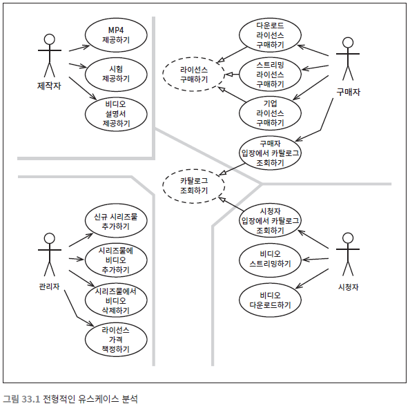
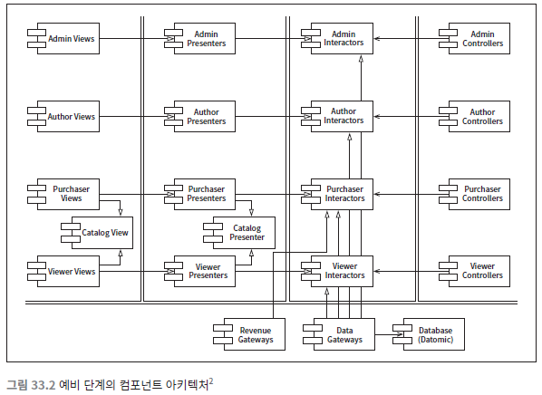

# 사례 연구 : 비디오 판매

> 지금까지 살펴본 아키텍처에 대한 규칙과 견해를 종합해서 사례 연구로 적용해보자

## 제품
웹 사이트에서 비디오를 판매하는 소프트웨어로 사례를 들어보자

- 개인 : 시청자인 동시에 구매자다
- 기업 : 다른 사람들이 시청할 비디로르 구매하는 사람이 따로있다.
- 비디오 제작자 : 비디오 파일과 비디오에 대한 설명서, 부속 파일을 제공해야 한다.
  - 부속파일 : 시험 , 문제, 해법, 소스 코드 등이 포함
- 관리자 : 신규 비디오 시리즈물을 추가하거나 기존 시리즈물에 비디오를 추가 또는 삭제하며, 다양한 라이선스에 맞춰 가격을 책정

**시스템의 초기 아키텍처를 결정하는 첫 단계는 액터와 유스케이스를 식별 하는 일이다.**

## 유스케이스 분석
단일 책임 원칙에 따르면 이들 네 액터가 시스템이 변경되어야 할 네 가지 주요 근원이 된다. 
신규 기능을 추가하거나 기존 기능을 변경해야 한다면, 그 이유는 반드시 이들 액터 중 하나에게 해당 기능을 제공하기 위해서다. 
따라서 우리는 시스템을 분할하여, 특정 액터를 위한 변경이 나머지 액터에게는 전혀 영향을 미치지 않게 만들고자 한다.

중앙의 점선으로 된 유스케이스를 주목하자. 이들은 추상 유스케이스다. 
추상 유스케이스는 범용적인 정책을 담고 있으며, 다른 유스케이스에서 이를 더 구체화한다.

## 컴포넌트 아키텍처

그림에서 이중으로 된 선은 아키텍처 경계를 나타낸다. 
뷰, 프레젠터, 인터랙터, 컨트롤러로 분리됨과 동시에 대응하는 액터에 따라 카테고리를 분리한 사실을 확인할 수 있다. 
특수한 컴포넌트인 `Catalog View`와 `Catalog Presenter`에 주목해보자 
이는 카탈로그 조회하기라는 추상 유스케이스를 처리하는 나만의 방식이다. 
이 뷰와 프레젠터는 해당 컴포넌트 내부에 추상클래스로 코드화될 것이며, 상속받는 컴포넌트에서는 이들 추상클래스로부터 상속받은 뷰와 프레젠터 클래스들을 포함한다. 

나는 컴파일과 빌드 환경은 분명히 이 형태로 나눌 것이며, 따라서 각 컴포넌트를 독립적으로 전달할 수 있게 빌드하는 것도 가능할 것이다. 
예를 들어 그림 33.2처럼 분할한 경우라면 총 다섯 개의 .jar 파일로 쉽게 합칠 수 있을 것이다. 
즉 뷰, 프레젠터, 인터랙터, 컨트롤러, 유틸리티 각각을 하나의 .jar 파일로 만들 수 있다.  
그러면 서로 독립적으로 변경될 가능성이 큰 컴포넌트들을 독립적으로 배포할 수 있게 된다. 

**이처럼 선택지를 열어두면 후에 시스템이 변경되는 양상에 맞춰 시스템 배포방식을 조정할 수 있다.**

## 의존성 관리
그림 33.2에서 제어흐름은 오른쪽에서 왼쪽으로 이동한다. 
모든 화살표가 오른쪽에서 왼쪽을 가리키지는 않음을 주목하자. 사실 대다수의 화살표는 왼쪽에서 오른쪽으로 향한다.  

이는 아키텍처가 의존성 규칙을 준수하기 때문이다. 
모든 의존성은 경계선을 한 방향으로만 가로지는데, 항상 더 높은 수준의 정책을 포함하는 컴포넌트를 향한다. 

또 하나, 사용 관계(열린 화살표)는 제어흐름과 같은 방향을 가리키며, 상속 관계(닫힌 화살표)는 제어흐름과는 반대 방향을 가리킴에 주목하자.  
이는 개방 폐쇄 원칙을 적용했음을 보여준다. 이를 통해 우리는 의존성이 올바방향으로 흐르며,  
따라서 저수준의 세부사항에서 발생한 변경이 상위로 파급되어서 상위 수준의 정책에 영향을 미치지는 않음을 보장할 수 있다.

# 결론
하나는 단일 책임 원칙에 기반한 액터의 분리이며, 두 번째 의존성 규칙이다. 

이 두 차원은 모두 서로 다른 이유로, 서로 다른 속도로 변경되는 컴포넌트를 분리하는 데 그 목적이 있다.  
서로 다른 이유라는 것은 액터와 관련이 있으며, 서로 다른 속도라는 것은 정책 수준과 관련이 있다. 

이런 방식으로 코드를 한번 구조화하고 나면 시스템을 실제로 배포 방식은 다양하게 선택할 수 있게 된다.  
상황에 맞게 컴포넌트들을 배포 가능한 단위로 묶을 수도 있고, 상황이 변하면 변한 상황에 맞춰 묶는 단위를 바꾸기도 쉬워진다.
