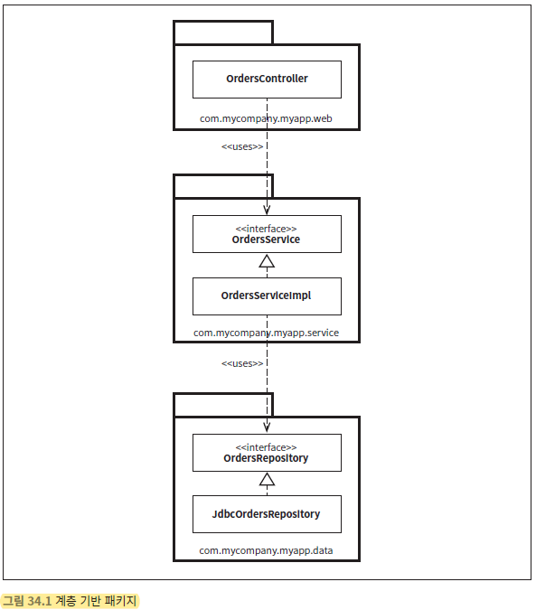
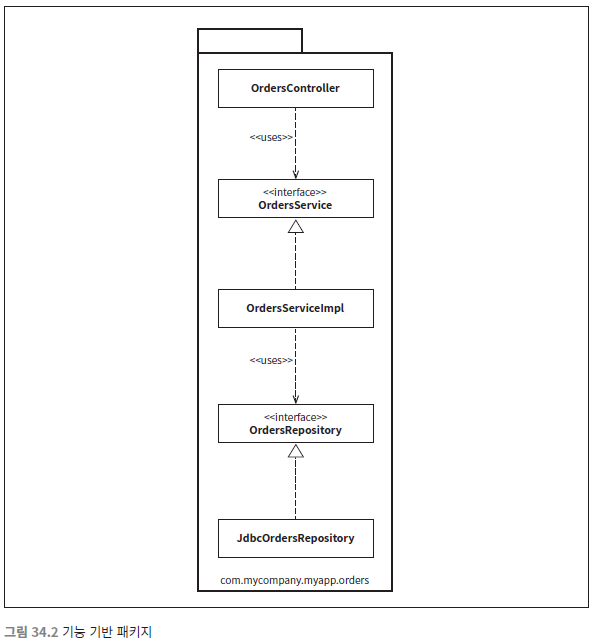
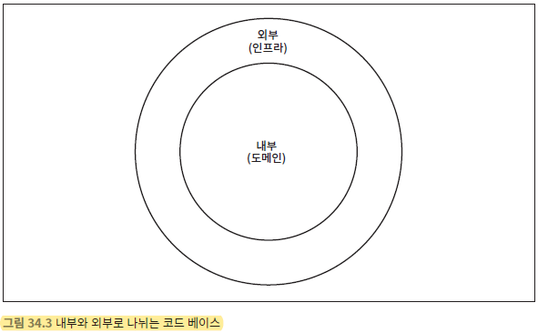
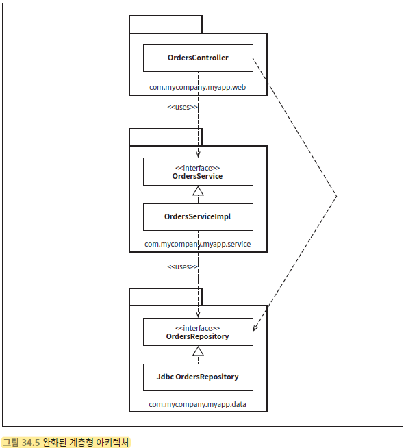
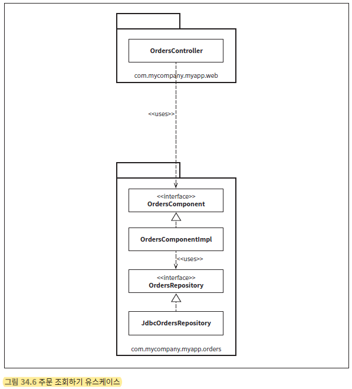
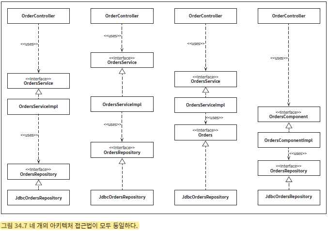
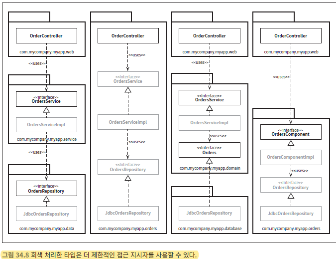

# 빠져 있는 장
올바르게 정의된 경계, 명확한 책임, 그리고 통제된 의존성을 가진 클래스와 컴포넌트로 구성될 것이다.  

하지만 악마는 항상 디테일(구현 세부사항)에 있는 법이며, 이점을 심사숙고하지 않다면 마지막 고비에 걸려 넘어지기 십상일 것이다. 

## 계층 기반 패키지
아마도 가장 단순한 첫 번째 설계 방식은 전통적인 수평 계층형 아키텍처다. 
기술적인 관점에서 해당 코드가 하는 일에 기반해 그 코드를 분할한다.  
흔히 우리는 이 방식을 `계층 기반 패키지`라고 부른다.

이 전형적인 계층형 아키텍처에는 웹, ‘업무 규칙’, 영속성 코드를 위해 계층이 각각 하나씩 존재한다.  
다시 말해 코드는 계층이라는 얇은 수평 조각으로 나뉘며, 각 계층은 유사한 종류의 것들을 묶는 도구로 사용된다.  

`엄격한 계층형 아키텍처`의 경우 계층은 반드시 바로 아래 계층에만 의존해야 한다. 
자바의 경우 계층은 주로 패키지로 구현된다. 그림 34.1에서 보듯이 계층(패키지) 사이의 의존성은 모두 아래를 향한다.  

이 예에서는 다음의 자바 타입들이 존재한다.

마틴 파울러 `프레젠테이션 도메인 데이터 계층화`에서 처음 시작하기에는 계층형 아키텍처가 적합하다고 얘기했다. 

다수의 책, 튜토리얼, 교육 과정, 샘플 코드 또한 계층형 아키텍처를 만드는 길로 인도한다.  
이 아키텍처는 엄청난 복잡함을 겪지 않고도 무언가를 작동시켜 주는 아주 빠른 방법이다. 

문제는, 마틴이 지적했듯이 소프트웨어가 커지고 복잡해지기 시작하면, 머지 않아 큰 그세 개만으로는 모든 코드를 담기엔 부족하다는 사실을 깨닫고, 
더 잘게 모듈화해야 할지를 고민하게 될 것이다. 
엉클 밥이 이미 언급했듯이, 계층형 아키텍처는 업무 도메인에 대해 아무것도 말해주지 않는다는 문제도 있다.

## 기능 기반 패키지

코드를 조직화하는 또 다른 선택지로 ‘기능 기반 패키지’ 구조도 있다. 
이는 서로 연관된 기능, 도메인 개념, 또는 `Aggregate Root`에 기반하여 수직의 얇은 조각으로 코드를 나누는 방식이다. 

이제 코드의 상위 수준 구조가 업무 도메인에 대해 무언가를 알려주게 된다. 
또 다른 이점으로, ‘주문 조회하기’ 유스케이스가 변경될 경우 변경해야 할 코드를 모두 찾는 작업이 더 쉬워질 수 있다.  
변경해야 할 코드가 여러 군데 퍼져 있지 않고 모두 한 패키지에 담겨 있기 때문이다. 

나는 소프트웨어 개발팀이 수평적 계층화(계층 기반 패키지)의 문제를 깨닫고, 수직적 계층화(기능 기반 패키지)로 전환하는 걸 자주 목격했다. 
내가 보기에 두 접근법은 모두 차선책이다. 이 책을 지금까지 읽었다면, 분명 이보다 훨씬 잘할 수 있을 거라고 생각할 것이다. 

## 포트와 어댑터

`내부`영역은 도메인 개념을 모두 포함하는 반면, `외부`영역은 외부 세계(예를 들면 UI, 데이터베이스, 서드파티 통합)와의 상호작용을 포함한다. 

여기에서 `com.mycompany.myapp.domain` 패키지가 `내부`이며, 나머지 패키모두 `외부`다.  
의존성이 `내부`를 향해 흐르는 모습에 주목하라.  

예리한 독자는 이전 다이어그램의 `OrdersRepository`가 `Orders`라는 간단한 이름으로 바뀌었음을 눈치챘을 것이다.  
이는 도메인 주도 설계라는 세계관에서 비롯된 명명법으로, 도메인 주도 설계에서는 `내부`에 존재하는 모든 것의 이름은 반드시 `유비쿼터스 도메인 언어` 관점에서 기술하라고 조언한다. 
바꿔 말하면, 도메인에 대해 논의할 때 우리는 `주문`에 대해 말하는 것이지, `주문 리포지터리`에 대해 말하는 것이 아니다. 

## 컴포넌트 기반 패키지

계층형 아키텍처를 좋지 않은 아키텍처로 여겨야 하는 이유를 몇 가지 들었지만, 이게 전부는 아니다.  
계층형 아키텍처의 목적은 기능이 같은 코드끼리 서로 분리하는 것이다. 

웹 관련 코드는 업무 로직으로부터 분리하고, 업무 로직은 다시 데이터 접근으로부터 분리한다. 
UML 클래스 다이어그램에서 봤듯이, 구현 관점에서 보면 각 계층은 일반적으로 자바 패키지에 해당한다.

코드의 접근성 관점에서 `OrdersController`가 `OrdersService` 인터페에 의존하려면 `OrdersService` 인터페이스는 반드시 `public`으로 선언되야 하는데, 
두 인터페이스는 서로 다른 패키지에 속하기 때문이다. 
마찬가지로 `OrdersRepository` 인터페이스도 `public`이어야만 `repository` 패키지 외부에 있는 `OrdersServiceImpl` 클래스에서 접근할 수 있다.

엄격한 계층형 아키텍처에서는 의존성 화살표는 항상 아래를 향해야 하며, 각 계층은 반드시 바로 아래 계층에만 의존해야 한다. 
이런 방식으로 멋지고 깔끔한 비순환 의존성 그래프를 만들 수 있을 거라 생각할 수도 있지만, 
정말로 코드 베이스의 요소들이 서로 의존할 때는 몇 가지 규칙을 반드시 지켜야 한다. 그런데 여기에는 큰 문제가 있다.  
속임수를 써서 몇몇 의존성을 의도치 않은 방식으로 추가하더라도, 보기에는 여전히 좋은 비순환 의존성 그래프가 생성된다는 사실이다. 

예를 들어 팀에서 신규 인력을 고용하여 주문과 관련된 또 다른 유스케이스를 구현하라고 지시했다고 가정해 보자.   
이 사람은 신입인 탓에 이 유스케이스를 가능한 한 빨리 구현해서 깊은 인상을 남기고 싶어한다.  
잠깐 동안 자리에 앉아 커피를 한잔 마시면 `OrdersController` 클래스가 이미 존재한다는 사실을 발견하고는  
주문 관련 웹 페이지의 신규 코드를 추가할 위치를 결정을 내린다.  
그런데 데이터베이스로부터 주문과 관련된 몇 가지 데이터가 필요해졌다.  
신입은 깨닫는다.  
`“아 OrdersRepository 인터페이스도 만들어져 있군. 이제 단순히 이 구현체를 내가 만들 컨트롤러에 의존성으로 주하면 될 거야. 완벽해!”`라고 말이다.  
잠시 동안 코드를 간단히 조작해서 웹 페이지가 동작하도록 만든다. 하지만 그 결과 만들어진 UML 다이어그램은 아래와 같다. 

> 새로운 유스케이스가 동작은 하겠지만 우리가 기대하는 형태로 구현되지는 않았다.

‘컴포넌트 기반 패키지’를 도입해야 하는 이유는 바로 이 때문이다.  
이 접근법은 지금까지 우리가 본 모든 것들을 혼합한 것으로, 큰 단위의단일 컴포넌트와 관련된 모든 책임을 하나의 자바 패키지로 묶는 데 주안을 둔다.   
이 접근법은 서비스 중심적인 시각으로 소프트웨어 시스템을 바라보며, 마이크로서비스 아키텍처가 가진 시각과도 동일하다.  

포트와 어댑터에서 웹을 그저 또 다른 전달 메커니즘으로 취급하는 것과 마찬가지로,   
컴포넌트 기반 패키지에서도 사용자 인터페이스를 큰 단위의 컴포넌트로부터 분리해서 유지한다.  
그림 34.6에서 ‘주문 조회하기’ 유스케이스가 어떤 모습인지 보여준다. 

컴포넌트 기반 패키지 접근법의 주된 이점은 주문과 관련된 무언가를 코딩해야 할 때 오직 한 곳, 즉 `OrdersComponent`만 둘러보면 된다는 점이다.   
이 컴포넌트 내부에서 관심사의 분리는 여전히 유효하며, 따라서 업무 로직은 데이터 영속성과 분리되어 있다.  
하지만 이는 컴포넌트 구현과 관련된 세부사항으로, 사용자는 알 필요가 없다.  

이는 마이크로서비스나 서비스 지향 아키텍처를 적용했을 때 얻는 이점과도 유사하다.  
즉, 주문 처리와 관련된 모든 것들을 캡슐화하는 별도 `OrdersService`가 존재한다.  

큰 차이는 결합 분리모드에 있다. 
모노리틱 애플리케이션에서 컴포넌트를 잘 정의하면 마이크로서비스 아키텍처로 가기 위한 발판으로 삼을 수 있다. 

## 구현 세부사항엔 항상 문제가 있다.

나는 자바와 같은 언어 `public` 접근 지시자를 지나칠 정도로 방만하게 사용하는 모습을 자주 본다.   
개발자인 우리 `public` 키워드를 아무런 고민 없이 마치 본능적으로 사용하는 것처럼 보인다.  
마치 우리 몸에 각인된 것 처럼 말이다. 

못 믿겠다면 책, 튜토리얼, 깃허브에 올라온 오픈 소스 프레임 워크에 딸린 샘플 코드를 한번 살펴보라.  
이러한 경향은 누가 봐도 분명하게 코드 베이스에서 지향한 아키텍처 스타일과도 아무런 관련이 없다.  
수평 계층형이든, 수직적 계층형이든, 포트와 어댑터 혹은 다른 무엇이든 모두 마찬가지다.

모든 타입 `public` 지시자를 사용한다는 건 사용하는 프로그래밍 언어가 제공하는 캡슐화 관련 이점을 활용하지 않겠다는 뜻이다.  
이로 인해 누군 가가 구체적인 구현 클래스의 인스턴스를 직접 생성하는 코드를 작성하는 일을 절대 막을 수 없으니,  
결국 당신이 지향하는 아키텍처 스타일을 위반하게 될 것이다. 

## 조직화 VS 캡슐화

이 문제를 다른 방식으로 한번 보자. 만약 자바 애플리케이션에서 모든 타입을 `public`으로 지정한다면,  
패키지는 단순히 조직화를 위한 메커니즘(폴더같이 무언가를 묶는 방식)으로 전락하여 캡슐화를 위한 메커니즘이 될 수 없다. 

`public` 타입을 코드 베이스 어디에서도 사용할 수 있다면 패키지를 사용하는 데 따른 이점이 거의 없다.   
따라서 사실상 패키지를 사용하지 않는 것과 같다. 
패키지를 무시해 버리면 (캡슐화나 은닉을 하는 데 아무런 도움도 되지 않으므로) 최종적으로 어떤 아키텍처 스타일로 만들려고 하는지는 아런 의미가 없어진다. 

`public` 지시자를 과용하면 이 장의 앞에서 제시한 네 가지 아키텍처 접근법은 본질적으로 완전히 같아진다.  
아래의 그림에서 각 타입 사이의 화살표를 유심히 살펴보라. 채택하려는 아키텍처 접근법과 아무런 관계 없이 화살표들이 모두 동일한 방향을 가리킨다.  
개념적으로 이 접근법들은 매우 다르지만, 구문적으로는 완전히 똑같다.  

이처럼 모든 타입 `public`으로 선언한다면, 우리가 실제로 갖게 되는 것은 수평적 계층형 아키텍처를 표현하는 네 가지 방식에 지나지 않는다.   
묘수처럼 보일 수도 있겠지만, 모든 자바 타입울 `public`으 지정하는 사람은 한 명도 없을 것이다. 

만약 다이어그램에서 패키지 구조를 다시 살려서 더 제한적인 접근 지시자를 사용할 수 있는 타입을 (흐리게) 표시하면, 
**다이어그램은 상당히 인상적으로 변한다.**

### 계층 기반 패키지
왼쪽부터 하나씩 살펴보자.   
먼저 ‘계층 기반 패키지’ 접근법에서 `Orders Service`와 `OrdersRepository`인터페이스는 외부 패키지의 클래스로부터  
자신이 속한 패키지 내부로 들어오는 의존성이 존재하므로 `public`으로 선언되어야 한다.  

반면 구현체 클래스 `OrdersServiceImpl`,`JdbcOrdersRepository`는 더 제한적으로 선언할 수 있다.  
이들 클래스는 누구도 알 필요가 없는 구현 세부사항이다. 

### 기능 기반 패키지
두 번째, ‘기능 기반 패키지’ 접근법에서는 `OrdersController`가 패키지로 들어올 수 있는 유일한 통로를 제공하므로 나머지는 모두 패키 `protected`로 지정할 수 있다.  
이 방식에서 가장 주의할 점은, 이 패키지 밖의 코드에서는 컨트롤러를 통하지 않으면 주문 관련 정보에 접근할 수 없다는 사실이다. 
이는 바람직할 때도 있고 아닐 때도 있다. 

### 포트와 어댑터
세 번째, ‘포트와 어댑터’ 접근법의 경우, `OrdersService`와 `Orders` 인터페이스는 외부로부터 들어오는 의존성을 가지므로 `public`을지정해야 한다.  
이 경우에도 구현 클래스는 패키지 `protected`로 지정하며, 런타임에 의존성을 주입할 수 있다. 

### 컴포넌트 기반 패키지
마지막으로 ‘컴포넌트 기반 패키지’ 접근법에서는 컨트롤러에서 `Orders Component`인터페이스로 향하는 의존성을 가지며,   
그 외의 모든 것은 패키지 protected로 지정할 수 있다. 
`public` 타입이 적으면 적을수록 필요한 의존성의 수도 적어진다. 
이제 이 패키지 외부의 코드에 `OrdersRepository`인터페이스나 구현체를 직접 사용할 수 있는 방법이 전혀 없다. 

## 다른 결합 분리 모드

다른 선택지로는 소스 코드 수준에서 의존성을 분리하는 방법도 있다.   
정확하게는 서로 다른 소스 코드 트리로 분리하는 방법이다.  

포트와 어댑터를 예로 들자면, 다음과 같은 소스 코드 트리를 만들 수 있다. 

- 업무와 도메인용 소스 코드(즉, 선택된 기술이나 프레임워크와는 독립적인 모든 것)
  - OrdersService, OrdersServiceImpl, Orders
- 웹용 소스 코드
  - OrdersController
- 데이터 영속성용 소스 코드
  - JdbcOrdersRepository

하지만 이는 너무 이상적인 해결책이다 
현실에서 소스 코드를 이처럼 나누다 보면 성능, 복잡성, 유지보수 문제가 생기기 때문이다.

# 결론 : 빠져있는 조언
이 장은 최적의 설계를 꾀했더라도, 구현 전략에 얽힌 복잡함을 고려하지 않으면 설계가 순식간에 망가질 수도 있다는 사실을 강조하는 데 그 목적이 있다.   
설계를 어떻게 해야만 원하는 코드 구조로 매핑할 수 있을지, 그 코드를 어떻게 조직화할지, 런타임과 컴파일타임에 어떤 결합 분리 모드를 적용할지를 고민하라.  
가능하다면 선택사항을 열어두되, 실용주의적으로 행하라.  
그리고 팀의 규모, 기술 수준, 해결책의 복잡성을 일정과 예산이라는 제약과 동시에 고려하라.  
또한 선택된 아키텍처 스타일을 강제하는 데 컴파일러의 도움을 받을 수 있을지를 고민하며,  
데이터 모델과 같은 다른 영역에 결합되지 않도록 주의하라.  
**구현 세부사항에는 항상 문제가 있는 법이다.**
