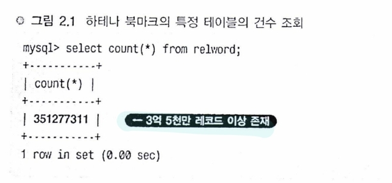

# 대규모 데이터 처리 입문

# 대규모 데이터 특유의 환경 알기

### 하테나 북마크를 예로 본 대규모 데이터   

그림 2.1은 하테나 북마크의 어느 엔트리에 어떤 키워드가 포함되어 있는지를 나타내는 DB 테이블의 건수를 출력한 것이다. 

3억 5천만 레코드가 있다.

이 테이블에 갑자기 select * from relword와 같은 쿼리를 실행하면 응답이 반환되지 않는데, 그 이유는 3억 레코드 이상이 존재하기 때문이다.

하테나 북마크의 데이터 규모를 대략 보면 relword라는 키워드용 테이블은 대략 10GB 정도, 전체적으로 간단히 말해 기가 바이트 단위가 된다고 할 수 있다.

대규모라고는 하지만 Google이나 Yahoo!가 사용하고 있는 규모가 되면 여기서 더 나아가 테라바이트, 페타바이트가 되므로 이는 초대규모이며, 이와 비교하자면 하테나는 대규모~중규모 정도이다.

그렇지만 보통 웹 애플리케이션을 만들면서 좀처럼 기가바이트 단위의 DB는 나오지 않으므로 일반적인 웹 애플리케이션을 관점에서 보면 큰 규모인 것이 다.

## 대규모 데이터로의 쿼리

`select url from entry use index(hoge) where eid = 96155899;`

위의 sql은 일부러 인덱스를 태우지 않고 쿼리를 던지고 있는 예이다. 1건을 검색하는 데 200초가 경과해도 검색결과가 나오지 않는다. 그렇다. 이것이 이 책에서 대상으로 하는 대규모 데이터에 대한 예이다.

레코드 수가 수천만 건 단위, 데이터 크기는 수 GB부터 수백 GB, 이 정도의 데이터가 되면 아무 생각 없이 던진 쿼리에 대해 응답하지 않는다. 디버그 목적으로 데이터를 출력해보니 엄청난 부하가 걸렸다는 말도 장난이 아닌 상황인 것이다.

데이터가 많으면 처리하는 데 시간이 걸리게 된다. 직감으로는 알겠으나 왜 그런지를 이해해두는 것이 중요하다.

## 대규모 데이터는 어떤 점이 어려운가?

### 대규모 데이터의 어려움은 메모리 내에서 계산할 수 없다는 점

- 메모리 내에서 계산할 수 없게 되면 디스크에 있는 데이터를 검색할 필요가 있다.
- 하지만 디스크는 느리므로 I/O(Input/Output)에 시간이 걸린다.
- 어떻게 대처할 것인가가 연구 대상
- 메모리는 디스크보다 10^5 ~ 10^6배 이상 빠르다.
- 전송속도에서도 메모리가 100배 이상 빠르다.

## 규모 조정의 요소

웹 서비스에서는 고가의 빠른 하드웨어를 사서 성능을 높이는 ‘스케일업(scale-up)’ 전략보다도 저가이면서 일반적인 성능의 하드웨어를 많이 나열해서 시스템 전체 성능을 올리는 ‘스케일아웃(scale-out)’ 전략이 주류이다.

스케일아웃 전략이 더 나은 이유는 웹 서비스에 적합한 형태이고 비용이 저렴하다는 점과 시스템 구성에 유연성이 있다는 점이 포인트다.

### CPU 부하의 규모조정은 간단하다.

- 같은 구성의 서버를 늘리고 로드밸런서로 분산
- 웹, AP 서버, 크롤러

### I/O 부하의 규모조정은 어렵다.

- DB
- 대규모 데이터